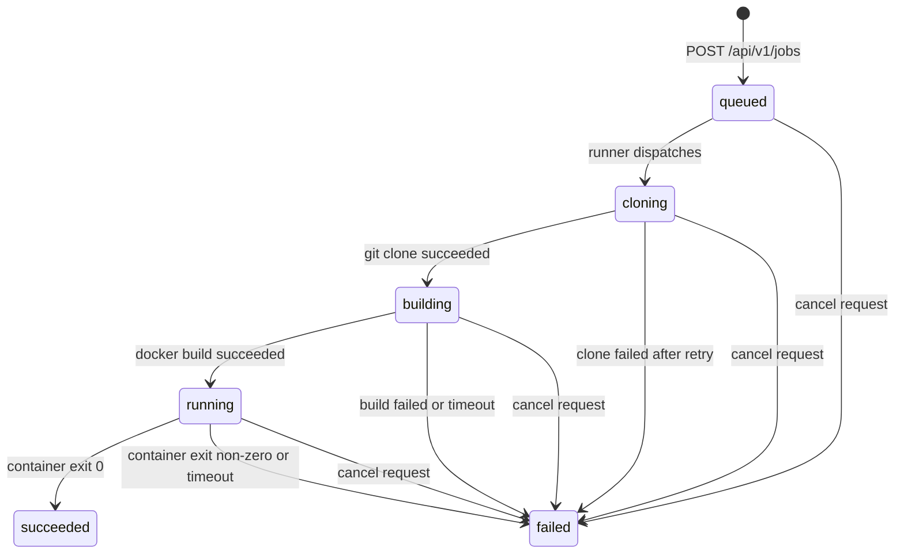

# Architecture

> Note: Mermaid diagrams render on GitHub and in most Markdown viewers. The ASCII
> topology diagram requires no renderer.

---

## Component Topology

```
Researcher / CI
      │  HTTPS (public hostname via Cloudflare)
      ▼
Cloudflare Tunnel  (ds01-cloudflared, cloudflared tunnel run)
      │  127.0.0.1:8765
      ▼
ds01-api  (FastAPI / uvicorn, binds to 127.0.0.1 only)
      │  aiosqlite (WAL mode)
      ▼
SQLite  /opt/ds01-jobs/data/jobs.db
      ▲
      │  aiosqlite (WAL mode)
ds01-runner  (asyncio poll loop, 5s interval)
      │  subprocess
      ▼
sudo -u <unix_user> /usr/local/bin/docker  (ds01-infra wrapper)
      │  injects cgroup parent, GPU allocation, memory limits
      ▼
Container  (researcher Dockerfile, writes results to /output/)
      │  docker cp /output/. → workspace/results/
      ▼
Results archive  (streamed as tar.gz via GET /api/v1/jobs/{id}/results)
```

The API and runner share the same SQLite database. The API writes new jobs (status
`queued`) and the runner reads and updates them. WAL mode allows concurrent readers and
one writer without blocking.

---

## Job Lifecycle



Each transition is a SQLite status update. Phase timestamps (`phase_timestamps` JSON
column) record `started_at` and `ended_at` for each phase - visible in GET
`/api/v1/jobs/{job_id}` responses.

**Phase details:**

- `queued` - Job accepted by API, waiting for runner to pick it up
- `cloning` - Runner runs `git clone --depth 1 --branch <branch> <repo_url>`. Retries once
  after 10 seconds on failure. Timeout: 120s.
- `building` - Runner runs `docker build -t ds01-job-<id>` as `sudo -u <unix_user>`.
  Timeout: 900s (15 minutes).
- `running` - Runner runs `docker run --name ds01-job-<id> --label ds01.interface=api
  --gpus all [resource_limits]`. Per-user timeout applies (default 4 hours, max 24 hours).
- `succeeded` / `failed` - Terminal states. Results are copied from `/output/` before the
  container is removed.

**Cancellation:** The API sets the job status to `failed`. The runner detects this on the
next cancellation check and sends SIGKILL to the running process group, then force-removes
the Docker container.

**Orphan recovery:** On startup, the runner marks any job in `cloning`, `building`, or
`running` state as `failed` with the message "Runner restarted - job interrupted". This
prevents jobs from being stuck in active states indefinitely after a restart.

---

## Authentication Flow

All API endpoints (except `/health`) require HMAC-SHA256 signed requests. The `ds01-submit`
CLI handles signing transparently. Raw HTTP clients must implement signing manually.

### Required headers

| Header | Format | Description |
|--------|--------|-------------|
| `Authorization` | `Bearer ds01_<base64url_key>` | The raw API key |
| `X-Timestamp` | Unix timestamp as float string | Request time |
| `X-Nonce` | Any unique string | Replay protection |
| `X-Signature` | HMAC-SHA256 hex digest | Signature over canonical string |

### Canonical string format

```
METHOD\nPATH\nTIMESTAMP\nNONCE\nBODY_SHA256_HEX
```

For example, a POST to `/api/v1/jobs` with a JSON body:

```
POST
/api/v1/jobs
1709123456.789
abc123xyz
e3b0c44298fc1c149afbf4c8996fb92427ae41e4649b934ca495991b7852b855
```

The signature is `HMAC-SHA256(raw_api_key, canonical_string)` expressed as a lowercase
hex string.

### Verification steps

The auth dependency (`auth.py`) performs these checks in order:

1. Key prefix - must start with `ds01_`
2. Key ID lookup - extracts first 8 chars of the base64url portion, queries `api_keys` table
3. Expiry check - key must not be expired or revoked
4. bcrypt verification - raw key hashed against `key_hash` (runs in thread pool to avoid
   blocking the event loop)
5. Signing header presence - `X-Timestamp`, `X-Nonce`, `X-Signature` must all be present
6. Timestamp freshness - within ±5 minutes (300 seconds)
7. Nonce uniqueness - in-memory cache (5 minute TTL), rejects replays
8. HMAC signature - canonical string verified with `hmac.compare_digest`

All failures return a generic HTTP 401 with no detail about which check failed, to prevent
information leakage. The specific failure reason is logged server-side.

### Key format

Keys have the format `ds01_<base64url_32bytes>`. The key ID is the first 8 characters of
the base64url portion (characters 5-13 of the full key string). The full raw key is stored
only by the client; the server stores a bcrypt hash.

### Expiry warning

Any authenticated response includes `X-DS01-Key-Expiry-Warning: YYYY-MM-DD` if the key
expires within 14 days.

---

## Dockerfile Scanning

Before any Docker build, the submitted Dockerfile is scanned statically. Violations with
severity `error` abort the submission immediately (HTTP 422). Warnings are logged but do
not block submission.

### What gets checked

**Base image registry (all FROM stages):**

Every `FROM` instruction is normalised to a fully-qualified registry path and checked
against the `DS01_JOBS_ALLOWED_BASE_REGISTRIES` list. Bare image names (e.g. `ubuntu`) are
normalised to `docker.io/library/ubuntu`. Default allowed registries:

```
docker.io/library/
nvcr.io/nvidia/
ghcr.io/astral-sh/
docker.io/pytorch/
docker.io/tensorflow/
docker.io/huggingface/
```

`FROM scratch` is always permitted. Images using unresolved build args (`${ARG}`) produce
an informational note - they cannot be statically verified.

**ENV keys (final stage only):**

ENV directives in the final build stage are checked against two lists:

- `DS01_JOBS_BLOCKED_ENV_KEYS` (default: `LD_PRELOAD`, `LD_LIBRARY_PATH`, `LD_AUDIT`) -
  produce errors (build blocked)
- `DS01_JOBS_WARNING_ENV_KEYS` (default: `LD_DEBUG`, `PYTHONPATH`) - produce warnings
  (build proceeds)

Only the final stage is checked for ENV keys - earlier stages in multi-stage builds are
ignored. This avoids false positives from base images or build-time tooling.

**USER root (final stage only):**

`USER root` in the final stage produces a warning. Containers still run with cgroup
constraints enforced by the Docker wrapper regardless of the USER directive.

See `src/ds01_jobs/scanner.py` for the full rule implementation.

---

## Rate Limiting

Two independent layers of rate limiting apply to job submissions.

### Global rate limit (slowapi)

The API applies a global limit of **60 requests per minute** per API key, enforced by
`slowapi`. The rate limit key is the key_id portion of the Bearer token (8 chars extracted
from the `Authorization` header). For unauthenticated requests, the client IP is used as
fallback.

This limit applies across all endpoints. Exceeding it returns HTTP 429 with a structured
JSON body and `Retry-After: 60`.

### Per-user job limits

Job submissions (`POST /api/v1/jobs`) also enforce per-user limits from SQLite:

- **Concurrent limit** - maximum number of active jobs (queued + cloning + building +
  running) at once. Default: 3.
- **Daily limit** - maximum job submissions since midnight UTC. Default: 10.

These limits are resolved per-request by calling `get_resource_limits.py --group` to
determine the user's resource group, then looking up group overrides in
`resource-limits.yaml`. The subprocess call has a 5-second timeout; on failure the system
falls back to the default limits from `DS01_JOBS_DEFAULT_CONCURRENT_LIMIT` and
`DS01_JOBS_DEFAULT_DAILY_LIMIT`.

### Rate limit response headers

Successful job submissions (HTTP 202) include these headers:

```
X-RateLimit-Limit-Concurrent: 3
X-RateLimit-Remaining-Concurrent: 2
X-RateLimit-Limit-Daily: 10
X-RateLimit-Remaining-Daily: 9
X-RateLimit-Reset-Daily: <unix timestamp of next midnight UTC>
```

---

## Database Schema

SQLite database at `DS01_JOBS_DB_PATH` (default `/opt/ds01-jobs/data/jobs.db`). WAL mode
enabled for concurrent API + runner access.

### api_keys table

| Column | Type | Description |
|--------|------|-------------|
| `id` | INTEGER PK | Auto-increment row ID |
| `username` | TEXT | GitHub username |
| `unix_username` | TEXT | Local POSIX account for `sudo -u` execution |
| `key_id` | TEXT UNIQUE | First 8 chars of the base64url key portion |
| `key_hash` | TEXT | bcrypt hash of the full raw key |
| `created_at` | TEXT | ISO8601 creation timestamp |
| `expires_at` | TEXT | ISO8601 expiry timestamp |
| `revoked` | INTEGER | `0` = active, `1` = revoked |
| `last_used_at` | TEXT | ISO8601, updated on each authenticated request |

Index: `idx_api_keys_key_id` on `key_id` (fast lookup on every auth request).

### jobs table

| Column | Type | Description |
|--------|------|-------------|
| `id` | TEXT PK | UUID job identifier |
| `username` | TEXT | GitHub username (FK to api_keys) |
| `unix_username` | TEXT | Local POSIX account for Docker execution |
| `repo_url` | TEXT | Git repository URL |
| `branch` | TEXT | Git branch (default `main`) |
| `gpu_count` | INTEGER | GPUs requested (1-8) |
| `job_name` | TEXT | Human-readable job name |
| `timeout_seconds` | INTEGER | Per-job timeout (NULL = default) |
| `dockerfile_content` | TEXT | Optional inline Dockerfile override |
| `status` | TEXT | One of: `queued`, `cloning`, `building`, `running`, `succeeded`, `failed` |
| `created_at` | TEXT | ISO8601 submission timestamp |
| `updated_at` | TEXT | ISO8601 last status change |
| `failed_phase` | TEXT | Phase in which failure occurred (`clone`, `build`, `run`) |
| `exit_code` | INTEGER | Container or process exit code |
| `error_summary` | TEXT | Human-readable failure description |
| `started_at` | TEXT | ISO8601, set when cloning begins |
| `completed_at` | TEXT | ISO8601, set on succeeded or failed |
| `phase_timestamps` | TEXT | JSON object with per-phase `started_at`/`ended_at` |

Indexes: `idx_jobs_status`, `idx_jobs_username_status`, `idx_jobs_username_created`.

---

## ds01-infra Integration

ds01-jobs integrates with ds01-infra at two points in the execution pipeline.

### Docker wrapper (`/usr/local/bin/docker`)

The executor runs all Docker commands as:

```bash
sudo -u <unix_username> /usr/local/bin/docker <subcommand> [args]
```

This is handled by the `sudo -u` prefix constructed in `JobExecutor._sudo_docker()`.
The wrapper at `/usr/local/bin/docker` (from ds01-infra) intercepts `docker run` calls and
injects:

- The user's cgroup parent (enforced kernel-level resource isolation)
- GPU device allocation
- Any additional constraints configured in ds01-infra

For `docker build` and `docker cp`, the wrapper passes through without modification.

If `unix_username` is empty (key created without a unix account, or during testing), the
executor calls the Docker binary directly without a `sudo -u` prefix and without resource
limit injection. Jobs still run but without per-user cgroup isolation.

### Resource limits resolver (`get_resource_limits.py`)

Before each `docker run`, the executor calls:

```bash
python3 /opt/ds01-infra/scripts/docker/get_resource_limits.py <unix_username> --docker-args
```

This returns Docker CLI flags for memory and shm limits (e.g. `--memory=32g
--shm-size=16g`). The `--cgroup-parent` flag is stripped from the output - the wrapper
injects it itself to avoid double-application.

The same script is called with `--group` during rate limit checking to resolve the user's
resource group for per-group concurrent/daily limit overrides:

```bash
python3 /opt/ds01-infra/scripts/docker/get_resource_limits.py <unix_username> --group
```

Both calls have a 5-second timeout. On failure (script not found, non-zero exit, timeout),
the system falls back gracefully - jobs run with Docker wrapper defaults, rate limits use
the configured defaults.

---

## Security Model

A summary of all security layers from network perimeter to execution.

### Network

- The API binds exclusively to `127.0.0.1:8765` - it is never reachable from the network
  directly
- Public access is via Cloudflare Tunnel only - no VPN, no open firewall ports
- Cloudflare provides DDoS protection and TLS termination at the edge

### Authentication

- HMAC-SHA256 signed requests - the shared key never appears in a signature-less request
- bcrypt-hashed key storage - server-side compromise does not expose raw keys
- Nonce replay protection - each request signature is one-time use (5 minute window)
- ±5 minute timestamp window - protects against delayed replay attacks
- All auth failures return a generic 401 - no detail leaked about which check failed

### Dockerfile scanning

- Checked before any build begins - no Docker layer pull costs on rejection
- Blocked base registries prevent pulling from arbitrary external sources
- Blocked ENV keys prevent linker injection attacks (`LD_PRELOAD`, `LD_LIBRARY_PATH`,
  `LD_AUDIT`)
- Final-stage-only ENV/USER checks avoid false positives from intermediate build stages

### URL validation

- Only `https://github.com/<org>/<repo>` URLs accepted
- SSRF prevention - git clone is the only network call made with user-supplied URLs
- Optional per-org allowlist (`DS01_JOBS_ALLOWED_GITHUB_ORGS`) for additional restriction
- HEAD preflight request verifies repository exists before accepting the job

### Rate limiting

- Global: 60 requests/minute per API key (slowapi) - prevents API abuse
- Per-user concurrent limit - prevents a single user from monopolising GPU capacity
- Per-user daily limit - prevents runaway automation

### Execution isolation

- Docker builds and runs execute as `sudo -u <unix_username>` - not as the `ds01` service
  user
- cgroup isolation enforced by the `/usr/local/bin/docker` wrapper from ds01-infra
- Process groups used for job processes - SIGKILL on cancellation hits the full process tree
- Container label `ds01.interface=api` marks API-submitted containers for identification

For API endpoint schemas and request/response examples, see
[docs/api-reference.md](api-reference.md).
